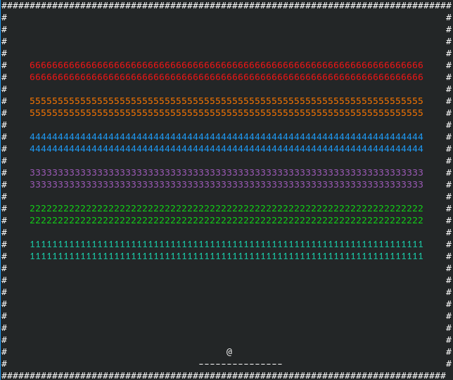

# Arkanoid 🎮

Arkanoid is a simple terminal-based brick-breaking game for Linux systems, implemented in modern C++.



## Features

- Support for CMAKE and C++17
- Smooth rendering of objects in the terminal
- Colorful design
- Simple controls

## Building Instructions

### 1) Clone the repository from GitHub

```
git@github.com:yasha-nev/Arkanoid.git
cd Arkanoid
```

### 2) Build project

```
cmake -B build
cmake --build build -j
```

### 3) Run the game

```
./build/arkanoid
```

## Controls

- Move paddle left: **a**
- Move paddle right: **d**
- Start game: **w**
- Quit game: **q**
